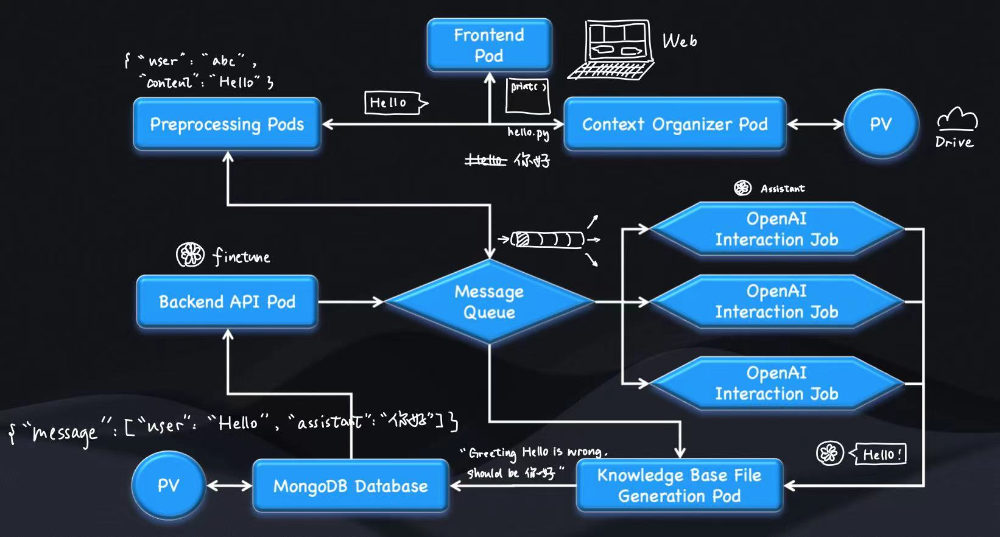

# IntelliDoc

> Cloud-native AI-assisted Multi-person Real-time Collaboration Document System Based On K8s

__Team Number__: SWS-3004, Group 6

__Team Member__:

We are DATA @ Summer Workshop, NUS.

> DATA is a Department of data-Analysis and neTworked Architecting

- Student 1: Boxuan Hu, t0933356.
- Student 2: Xiliang Xian, t0933753.
- Student 3: Xinyuan Xia, t0933528.
- Student 4: Shuyang Zhou, .

## 1. Project Overview

### 1.1 Project Description

This system is an AI-assisted document editor based on Kubernetes, integrating multiple components such as a frontend interface, backend processing, data preprocessing, message queue, data storage, knowledge base generation, and AI interaction. 

The whole system is designed with scalability, high availability, and efficient data processing in mind, aiming to provide a smooth and intelligent document editing experience.

It leverages LLM to improve user development efficiency and fully collects and utilizes various data generated during user development to enhance the accuracy of the dedicated model and enrich its knowledge base.

### 1.2 System Architecture



__Main Function__

- AI-assisted document editor based on Kubernetes and Cloud
- Multiple components for efficient and intelligent document editing
- Collecting data when using for a project-tailored AI

### 1.3 Key Components

- **Frontend Pod**: User interface for document input and editing.
- **Preprocessing Pods**: Cleanses and formats input data.
- **Context Organizer Pod / Cloud Drive**: Formats content for display and interaction.
- **Message Queue**: Temporary data storage and transmission.
- **OpenAI Interaction Job**: Uses AI-assistant to handle requests.
- **Knowledge Base File Generation**: Create structured knowledge files.
- **MongoDB Database**: Persistent document storage.
- **Backend API Pod**: Uses correction messages from mongoDB Database to finetune a new model.

## 2. Environment Setup

### 2.1 Prerequisites

List all the prerequisites needed to set up the environment.

- **Software 1**: Version and installation link.
- **Software 2**: Version and installation link.
- **Library 1**: Version and installation command.

### 2.2 Installation

Step-by-step guide to setting up the development environment.

1. **Step 1**: Description and command.

   ```bash
   command_to_run
   ```
2. **Step 2**: Description and command.

   ```bash
   command_to_run
   ```

## 3. Application Deployment

Detailed steps to deploy the application.

1. **Step 1**: Description and command.

   ```bash
   command_to_run
   ```
2. **Step 2**: Description and command.

   ```bash
   command_to_run
   ```

**Note**: Replace placeholders with actual details relevant to the project. Ensure all commands and links are accurate and up to date.
