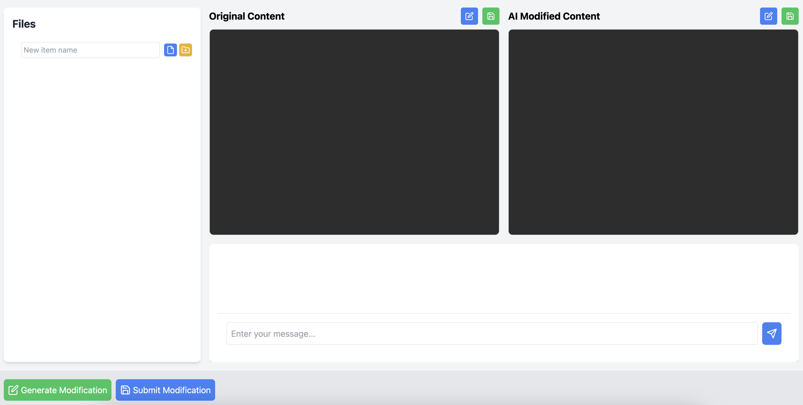

# Web UI System

- This part corresponds to the Frontend and part of Backend of the entire system
- It is supported by [React]()

## Local Deployment

### Preconditions

Your computer needs to be configured with the __node.js__ environment

You can config your system by [node.js installation](https://react.dev/learn/installation)

### Clone and Checkout

```bash
git clone https://github.com/Cloud-Computing-Group-NUS/Project-Code.git
git checkout Web
```

### Initialization

```bash
npm install
npm start
```

And you will get this:

```bash
Compiled successfully!

You can now view cloud-drive-app in the browser.

  Local:            http://localhost:3000
  On Your Network:  http://172.31.34.17:3000

Note that the development build is not optimized.
To create a production build, use npm run build.

webpack compiled successfully
```

Click the localhost and then you will get the UI in your browser

### UI



## Cloud Deployment

It's recommended to deploy kubenetes on AWS ([Amazon Web Services](https://aws.amazon.com/free/))

You can follow these steps on [aws-tutorial](https://blog.bxhu2004.com/LECTURE/AWS-Server/aws-install/)
