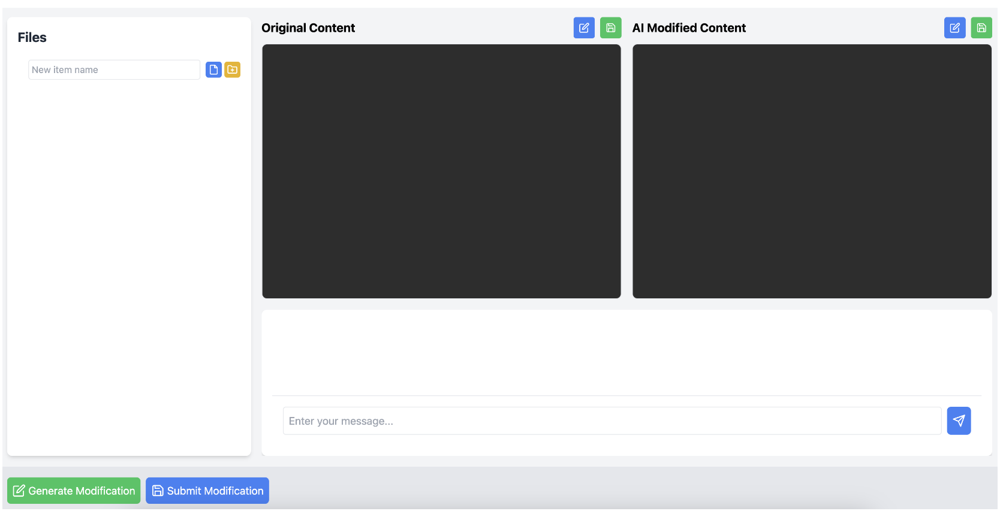

# IntelliDoc

> Cloud-native AI-assisted Multi-person Real-time Collaboration Document System Based On K8s

__Team Number__: SWS-3004, Group 6

__Team Member__:

We are DATA @ Summer Workshop, NUS.

> DATA is a Department of data-Analysis and neTworked Architecting

- Student 1: Boxuan Hu, t0933356.
- Student 2: Xiliang Xian, t0933753.
- Student 3: Xinyuan Xia, t0933528.
- Student 4: Shuyang Zhou, t0933418.

## 1. Project Overview

### 1.1 Project Description

This system is an AI-assisted document editor based on Kubernetes, integrating multiple components such as a frontend interface, backend processing, data preprocessing, message queue, data storage, knowledge base generation, and AI interaction.

The whole system is designed with scalability, high availability, and efficient data processing in mind, aiming to provide a smooth and intelligent document editing experience.

It leverages LLM to improve user development efficiency and fully collects and utilizes various data generated during user development to enhance the accuracy of the dedicated model and enrich its knowledge base.

### 1.2 System Architecture


__Main Function__

- AI-assisted document editor based on Kubernetes and Cloud
- Multiple components for efficient and intelligent document editing
- Collecting data when using for a project-tailored AI

### 1.3 Key Components

- **Frontend Pod**: User interface for document input and editing.
- **Preprocessing Pods**: Cleanses and formats input data.
- **Context Organizer Pod / Cloud Drive**: Formats content for display and interaction.
- **Message Queue**: Temporary data storage and transmission.
- **OpenAI Interaction Job**: Uses AI-assistant to handle requests.
- **Knowledge Base File Generation**: Create structured knowledge files.
- **MongoDB Database**: Persistent document storage.
- **Backend API Pod**: Uses correction messages from mongoDB Database to finetune a new model.

## 2. Quick Start

You can visit [here](http://100.24.7.54:32478/) to explore this App (updated on 18/07/2024)

## 3. Environment Setup

### 3.1 Prerequisites

List all the prerequisites needed to set up the environment.

- **Node.js**:
  - Version: v22.4.1
  - Installation: [node-Installation](https://nodejs.org/zh-cn/download/package-manager/)
- __React__:
  - Version: @18.3.1
  - Installation: [react-Installation](https://react.dev/learn/installation)
- **Library 1**: Version and installation command.

### 3.2 Installation

> Tips: Actually, this part (3.2) is not necessary if you just want to experience our App rather than deploying it.

__Structure__

- main
  - [README.md](https://github.com/Cloud-Computing-Group-NUS/Project-Code/blob/main/README.md "README.md")
- AI-system
  - AI Agent
    - a
    - a
    - a
  - AI Finetune
    - b
    - b
    - b
- Kubenetes
  - c
  - c
  - c
- Drive
  - d
  - d
  - d
- Web
  - [README.md](https://github.com/Cloud-Computing-Group-NUS/Project-Code/blob/Web/README.md "README.md")
  - Local Deployment
    - [public](https://github.com/Cloud-Computing-Group-NUS/Project-Code/tree/Web/public "public")
    - [src](https://github.com/Cloud-Computing-Group-NUS/Project-Code/tree/Web/src "src")
    - [nginx.conf](https://github.com/Cloud-Computing-Group-NUS/Project-Code/blob/Web/nginx.conf "nginx.conf")
  - Cloud Deployment
    - [Dockerfile](https://github.com/Cloud-Computing-Group-NUS/Project-Code/blob/Web/Dockerfile "Dockerfile")
    - [dependencies.txt](https://github.com/Cloud-Computing-Group-NUS/Project-Code/blob/Web/dependencies.txt "dependencies.txt")
    - [package-lock.json](https://github.com/Cloud-Computing-Group-NUS/Project-Code/blob/Web/package-lock.json "package-lock.json")
    - [package.json](https://github.com/Cloud-Computing-Group-NUS/Project-Code/blob/Web/package.json "package.json")


#### 3.2.1 Local Deployment WebUI

**Step 1**: Clone and Checkout

```bash
git clone https://github.com/Cloud-Computing-Group-NUS/Project-Code.git
git checkout Web
```

**Step 2**: Initialization

```bash
npm install
npm start
```

And you will get this:

```bash
Compiled successfully!

You can now view cloud-drive-app in the browser.

  Local:            http://localhost:3000
  On Your Network:  http://172.31.34.17:3000

Note that the development build is not optimized.
To create a production build, use npm run build.

webpack compiled successfully
```

Click the localhost and then you will get the UI in your browser:



#### 3.2.2 AI Agent Deployment

**Obtain API Key**

To obtain an API key, you need to sign up for an OpenAI account and log in to [OpenAI platform](https://platform.openai.com/api-keys).

To use `assistant` and `finetune`, you may need to top up some money (like 5 dollars) in advance through a foreign credit card (American credit card works for me).

**Dockerize the application**

You can either build a docker file locally or pull the image from our docker hub. For the first option, you can run the following command:

```bash
cd ai_agent
docker build -t <your dockerhub name>/ai-agent .
docker push <your dockerhub name>/ai-agent
```

Then change image name in   `ai-deployment.yaml` to `<your dockerhub name>/ai-agent`.

For the second, no additional steps are needed.

__Modify the secrets__

In this part, we've used a k8s object `secret` to protect our API key. First run the following command to encode your API key:

```bash
echo -n "<your_api_key>`" | base64
```

for example:

```bash
echo -n "sk-1234567890" | base64
```

Then replace the value of `api-key` in `ai-secrets.yaml` with the output of the above command.

**Deploy the application**

After connecting to the cloud and forms a cluster, you can run the following code to build the application:

```bash
cd ai-agent/
kubectl apply -f ai-secrets.yaml
kubectl apply -f ai-deployment.yaml
kubectl apply -f ai-service.yaml
```

#### 3.2.3 AI Finetune Deployment

**Obtain API Key**

 Follow instructions from AI-agent. finetune has been bound to the same secret from `ai_finetune_deployment.yaml`

**Dockerize the application**

You can either build a docker file locally or pull the image from our docker hub. For the first option, you can run the following command:

```bash
cd finetune
docker build -t <your dockerhub name>/finetune .
docker push <your dockerhub name>/finetune
```

Then change image name in   `ai_finetune_deployment.yaml` to `<your dockerhub name>/finetune`.

For the second, no additional steps are needed.

**Deploy the application**

After connecting to the cloud and forms a cluster, you can run the following code to build the application:

```bash
cd finetune/
kubectl apply -f ai_finetune_deployment.yaml
kubectl apply -f ai_finetune_service.yaml
kubectl apply -f ai_finetune_pvc.yaml
kubectl apply -f ai_finetune_pv.yaml
```

Note that finetune is rather costly.

#### 3.2.4 Local Deployment WebUI

## 4. Application Deployment

Here are brief information concerning application deployment. You can get detailed steps in __3. Environment Setup__

If you just want to experience our App rather than deploying it, please jump to __2. Quick Start__

- WebUI Deployment

  - Get source code
  - Initialization
  - Run the web page
- AI System (AI Agent / AI Finetune)

  - Obtain API Key
  - Dockerize the application
  - Deploy the application
